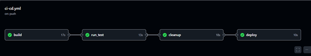
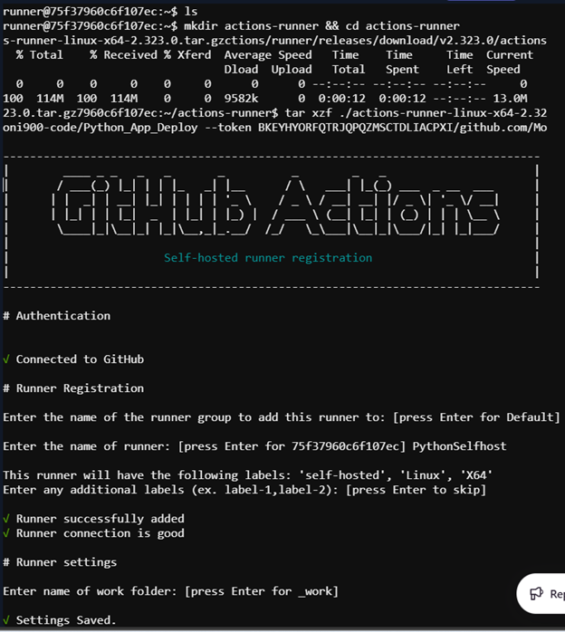
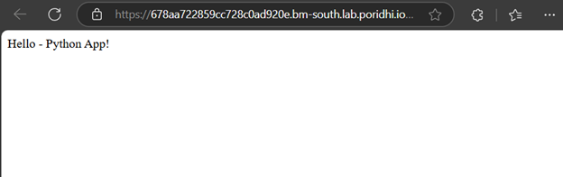

# Python Application Deploy with Selfhosted GitHub Runner

This document explains how to build a CI/CD pipeline for a Python-based web application using **GitHub Actions**, **Docker**, and a **self-hosted GitHub runner**. 
Here, 
1. **GitHub Actions**  
A CI/CD tool that automates tasks like code testing, building, and deployment. Workflows are defined in YAML files, and they run automatically when triggered by events like pushing code.

2. **Docker**  
A platform that packages applications and their dependencies into containers, ensuring they run consistently across different environments. Containers are lightweight and isolated.

3. **Self-hosted GitHub Runner**  
A machine (physical/virtual) you set up to run GitHub Actions workflows. It gives you more control over the environment, faster execution, and potentially lower costs compared to GitHub's cloud-hosted runners.

In short:
- **GitHub Actions** automates your workflows.
- **Docker** ensures consistent application environments.
- **Self-hosted GitHub Runner** allows you to run workflows on your own machine for more control and efficiency.
---

## Objective of this task
For deploying a Python application, to automatically:

- Build Docker image
- Test the application inside a container
- Clean up temporary containers/images
- Deploy the final versioned container in detached mode

## Workflow diagram: 


---

## Project Structure
```
.
├── app/
│   └── app.py             # Flask application source
├── Dockerfile             # Containerization setup
├── requirements.txt       # Python dependencies
└── .github/
    └── workflows/
        └── ci-cd.yml      # GitHub Actions workflow
```
Here, 
1. **`requirements.txt`** - Python Dependencies 

    ```txt
    flask
    ```
    **flask** is a lightweight web framework for Python, which we have used in the `app.py` file.  
    This file will be used during Docker build to install the required dependency.

---
2. **`Dockerfile`** - Python Dependencies 

    ```Dockerfile
    FROM python:3.10-slim                 # Lightweight Python base image

    WORKDIR /app                          # Set the working directory inside the container

    COPY requirements.txt .               # Copy dependency list to the working directory
    RUN pip install -r requirements.txt   # Install Python dependencies

    COPY app/ /app/                       # Copy Flask app code into the container

    EXPOSE 5000                           # Open port 5000 for communication

    CMD ["python3", "app.py"]              # Command to run the application on container start
    ```
 

3. **`.github/workflows/ci-cd.yml`** - GitHub Actions Workflow 

    This section defines the entire CI/CD pipeline using GitHub Actions. Let's go through it step by step:

    ```yaml
    name: CI/CD Pipeline Python App
    ```

    This specifies the name of the pipeline in GitHub Actions.

    ```yaml
    on:
      push:
        branches:
          - main
    ```

    This pipeline will trigger whenever there is a `push` to the `main` branch.

    ```yaml
    env:
      IMAGE_NAME: python-app
      VERSION_TAG: v${{ github.run_id }}
    ```
    Global environment variables:
    - `IMAGE_NAME`: The name of the Docker image.
    - `VERSION_TAG`: A unique version tag generated using `run_id` for each run.

    ---

    - `build` Job

    ```yaml
    jobs:
      build:
        runs-on: self-hosted
    ```
    This job will run on a **self-hosted runner** (which you have set up beforehand).

    ```yaml
        steps:
          - name: Checkout code
            uses: actions/checkout@v3
    ```
    This step checks out the code from GitHub into the local runner.

    ```yaml
          - name: Show directory contents (debug)
            run: |
              echo "Current Directory: $(pwd)"
              ls -la
              ls -la app/
    ```
    This step is for debugging purposes, showing the directory structure of the project.

    ```yaml
          - name: Build Docker image
            run: docker build -t $IMAGE_NAME:${{ env.VERSION_TAG }} .
    ```
    This step builds the Docker image using the provided `Dockerfile` and assigns a version tag to the image.

    ---

    - `run_test` Job

    ```yaml
      run_test:
        runs-on: self-hosted
        needs: build
    ```
    This job will only run if the `build` job is successful.

    ```yaml
          - name: Run container for testing
            run: docker run -d -p 4000:5000 --name test_container $IMAGE_NAME:${{ env.VERSION_TAG }}
    ```
    This step runs a container from the built image, mapping port 4000 on the host to port 5000 in the container.

    ```yaml
          - name: Wait for app
            run: sleep 5
    ```
    This step waits for 5 seconds to ensure that the Flask app has fully started.

    ```yaml
          - name: Test with curl
            run: |
              curl -f http://localhost:4000 || (echo "Test failed!" && exit 1)
    ```
    It uses `curl` to check if the app is responding correctly on port 4000. If it fails, the pipeline stops with an error.

  

    - `cleanup` Job

    ```yaml
      cleanup:
        runs-on: self-hosted
        needs: run_test
        if: always()
    ```
    This job will run after the `run_test` job, regardless of whether it succeeds or fails.

    ```yaml
          - name: Stop and remove test container
            run: |
              docker stop test_container || true
              docker rm test_container || true
    ```
    This step stops and removes the test container if it exists.

    ```yaml
          - name: Remove dangling containers/images
            run: |
              docker container prune -f
              docker image prune -f
    ```
    Removes any unused or "dangling" containers and images to keep the environment clean.

    ---

    - `deploy` Job

    ```yaml
      deploy:
        runs-on: self-hosted
        needs: cleanup
    ```
    This job will run only after the `cleanup` job completes.

    ```yaml
          - name: Deploy final version
            run: docker run -d --name deployed_container -p 8000:5000 $IMAGE_NAME:${{ env.VERSION_TAG }}
    ```
    This step runs the final container in detached mode and exposes it on port 8000 for production access.

    ---

    Summary of CI/CD Steps

    | Job        | Description |
    |------------|-------------|
    | `build`    | Checks out code and builds the Docker image |
    | `run_test` | Runs the container and tests it using `curl` |
    | `cleanup`  | Cleans up test containers and unused images |
    | `deploy`   | Deploys the production container on port 8000 |

**Visualization of Jobs:**




---

##  Self-hosted Runner Setup

To use a self-hosted runner, configure it on your local machine or server:

1. Go to your GitHub repository → **Settings** → **Actions** → **Runners** → **New self-hosted runner**.
2. Follow the instructions provided by GitHub to download and configure the runner. Example commands:

```bash
mkdir actions-runner && cd actions-runner
curl -o actions-runner-linux-x64-2.316.1.tar.gz -L https://github.com/actions/runner/releases/download/v2.316.1/actions-runner-linux-x64-2.316.1.tar.gz
tar xzf ./actions-runner-linux-x64-2.316.1.tar.gz

./config.sh --url https://github.com/<your-username>/<repo-name> --token <generated-token>
./run.sh
```
Expected Output: 



---

##  Push Code to GitHub

Initialize a Git repository, add files, and push to GitHub:

```bash
git init
git remote add origin https://github.com/your-username/node-frontend-app.git
git add .
git commit -m "Initial commit"
git push -u origin main
```

Pushing to the `main` branch triggers the GitHub Actions workflow.

## Final Access

After pipeline runs, access the deployed Python Flask app from:
```
http://<Your-Poridhi-Lab-IP>:8000
```

## **Visualization of the python application:**




## Conclusion
This project showcases an end-to-end CI/CD pipeline for a Python Flask app using Docker, GitHub Actions, and a self-hosted runner. It automates build, test, and deployment, ensuring a reliable and repeatable DevOps workflow.

🚀 Streamline your deployments with Poridhi Lab!
---


